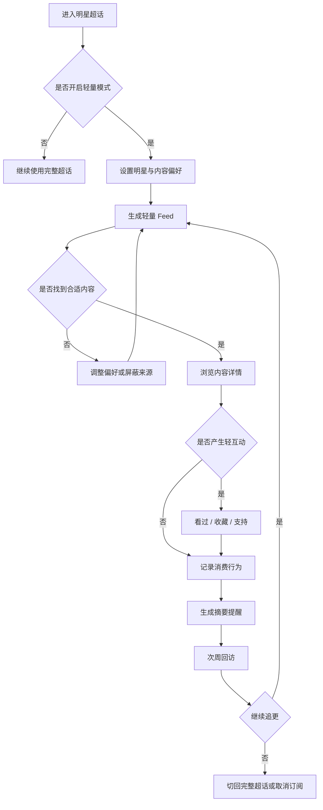

# 微博超话轻量追星模式 PRD

## 1. 文档信息

- 产品名称：微博超话轻量追星模式
- 文档版本：v1.1
- 更新时间：2026-09-15
- 文档类型：C 端社区产品与简历作品集 PRD
- 当前阶段：MVP 方案与低保真原型完成，待真实用户验证
- 目标平台：iOS、Android
- 项目范围：在微博超话内新增可切换的轻量追星体验，不替代原有任务与社区体系

## 2. 行业背景与机会（明星社交媒体）

### 2.1 行业现状

- 明星内容具有高频、热点化、多平台分发的特点，官方动态、作品物料、公开行程、粉丝创作和讨论持续产生。
- 微博超话集中了明星与粉丝关系，社区内容供给充足，但内容类型和参与强度差异很大。
- 小红书、抖音等产品强化了搜索、推荐和内容消费效率，用户对“快速找到有用内容”的要求不断提高。
- 粉丝用户并非只有一种参与方式。除高活跃粉丝外，还存在大量只想看动态、作品和行程的轻量粉丝。

### 2.2 核心痛点

- 内容混排导致筛选成本高。动态、作品、行程、二创、讨论和任务内容处于同一信息环境，用户需要持续判断内容价值。
- 互动机制偏重。发帖、评论、签到、打榜等行为对轻量用户而言存在时间和身份表达压力。
- 通知由社区事件和运营节奏驱动，用户缺少按内容类型和重要性控制提醒的能力。
- 高质量内容缺少稳定的沉淀和复用入口，用户下一次进入仍需要重新寻找。
- 现有超话主要服务高活跃粉丝，轻量粉丝没有明确、可切换的产品模式。

### 2.3 机会判断

- 用户需要的不只是更多明星内容，而是一个能控制内容类型、互动强度和提醒节奏的轻量入口。
- 微博超话的优势是明星关系集中、官方与粉丝内容沉淀深，适合在现有社区内增加模式化体验。
- 轻量模式可以把“内容消费”和“粉丝任务”拆开，让不同参与强度的用户都能获得价值。
- 相比重做完整社区，增加可切换的轻量体验成本更可控，也更容易验证用户需求。

## 3. 目标用户与场景

### 3.1 目标用户

- 轻量粉丝：关注 1–3 位明星，每天愿意投入约 10–30 分钟查看动态、作品和公开行程，很少参与签到、打榜和公开发帖。
- 作品型用户：因剧集、电影、综艺或音乐关注明星，核心目标是追作品更新和播出信息。
- 阶段性粉丝：原本参与社区活动，当前因工作、学习或兴趣变化减少参与，但仍希望保留重要信息订阅。

### 3.2 核心场景

- 快速追更：用户每天用有限时间查看明星过去 24 小时的重要动态，不想浏览重复内容和争议讨论。
- 作品跟进：用户订阅某部剧集或作品，希望在物料、播出时间和官方更新出现时收到摘要或即时提醒。
- 低压力互动：用户看到喜欢的内容后，希望收藏、标记看过或表达支持，但不产生公开动态。
- 阶段性回访：用户暂时不参与应援和任务，只保留明星关注关系和重要更新提醒。
- 内容降噪：用户屏蔽重复、营销或冲突内容，调整后续内容偏好。

### 3.3 JTBD

- 当我因为作品或兴趣关注一位明星时，我希望快速看到官方、作品和行程等重要内容，并能按自己的节奏表达喜欢，而不是被签到、榜单和争议讨论干扰。
- 当明星出现重要更新时，我希望只收到我订阅的内容类型和摘要提醒，以便在有限时间内完成查看。
- 当某个内容类型不再符合我的兴趣时，我希望调整偏好或屏蔽相关来源，让后续 Feed 更快适应我的需求。

## 4. 产品定位与价值主张

### 4.1 产品定位

- 面向轻量粉丝的明星内容消费与低压力参与模式，内嵌于微博超话，不替代原有粉丝社区。

### 4.2 价值主张

- 看得更快：用内容分类和偏好订阅减少信息筛选时间。
- 参与更轻：看过、收藏、支持等行为默认不公开，降低表达压力。
- 提醒更准：从社区事件驱动转为用户偏好驱动，减少任务和营销打扰。
- 选择权在用户：用户可以随时切换模式、调整内容类型、取消订阅和恢复原有超话体验。
- 数据可沉淀：收藏、订阅和已读状态可支持后续回访，不要求用户每次重新寻找。

### 4.3 产品边界

- 本期不重做微博超话完整信息架构。
- 本期不替代签到、打榜、控评和粉丝任务体系。
- 本期不建设新的社交关系链和独立社区。
- 本期不依赖复杂推荐模型，优先使用可解释的规则排序验证产品机制。
- 本期不新增广告、交易和商业化链路。

## 5. 产品目标与成功指标

### 5.1 北极星指标

- 轻量模式用户的 7 日有效内容消费留存率。
- 定义：统计周期内开启轻量模式，并在 7 日内至少 2 个自然日发生 1 次有效内容消费的用户数，除以同期开启轻量模式的用户数。
- 有效内容消费：进入内容详情达到停留阈值、收藏、表达支持，或连续浏览 3 条以上内容。

### 5.2 关键业务指标

- 轻量模式入口曝光率
- 轻量模式开启率
- 偏好设置完成率
- 内容详情打开率
- 轻互动率
- 摘要通知打开率
- 7 日有效内容消费留存率
- 单用户平均有效内容消费条数

### 5.3 反向指标

- 内容举报率
- 作者或话题屏蔽率
- 通知关闭率
- 用户切回完整超话后的流失率
- 高活跃用户任务与社区功能使用下降幅度
- 内容空状态触发率

### 5.4 目标方向（待基线验证）

- 从入口进入轻量 Feed 的操作步骤不超过 3 步。
- 首次偏好设置时长中位数不超过 2 分钟。
- 7 日有效内容消费留存率相对对照组有显著提升。
- 通知关闭率不高于对照组。
- 高活跃用户的签到、任务和社区功能使用不出现显著下降。
- 在没有真实基线数据前，不填写虚构的提升数值。灰度上线前先采集至少 2 周基线，再冻结实验阈值。

## 6. 功能需求（以用户价值为核心）

### 6.1 已实现（作品集 MVP 方案）

1. 超话首页轻量模式入口

   - 在超话首屏顶部展示轻量模式信息卡。
   - 用户关闭入口后不重复强推，可在设置中再次开启。
   - 用户价值：知道存在一种更轻的追星方式，同时不影响原超话使用。

2. 首次开启引导

   - 解释三项能力：自选内容、私密轻互动、重要更新提醒。
   - 明确说明用户可以随时切回完整超话，原有数据不会丢失。
   - 用户价值：降低概念理解和隐私顾虑。

3. 明星与内容偏好设置

   - 支持选择关注对象、内容类型和提醒节奏。
   - 内容类型包括动态、作品、行程、官方资讯、粉丝创作和讨论观点。
   - 用户价值：用最少操作定义真正想看的内容。

4. 轻量 Feed 与内容分类

   - 提供今日、作品、行程和创作等内容 Tab。
   - 官方认证、作品更新和公开行程优先展示。
   - 重复图片、争议讨论和任务帖默认折叠或降权。
   - 用户价值：提高相关内容密度，减少判断成本。

5. 内容详情与私密轻互动

   - 提供看过、收藏和支持三种轻互动。
   - 轻互动默认不产生公开动态。
   - 支持举报、屏蔽作者、屏蔽话题和屏蔽内容类型。
   - 用户价值：满足表达需求，同时降低公开发帖压力。

6. 追更订阅管理

   - 用户可以管理明星、作品、内容类型和提醒节奏。
   - 取消订阅后保留历史收藏，但不再推送相关更新。
   - 用户价值：让兴趣可以持续调整，不要求用户一次性设置正确。

7. 摘要提醒与通知控制

   - 支持重要更新即时提醒、每日摘要和每周摘要。
   - 任务、榜单、营销和无关讨论不进入轻量模式默认提醒。
   - 用户价值：在重要内容出现时回流，降低通知打扰。

8. 空状态与异常处理

   - 覆盖加载中、空内容、离线、审核中、内容删除和无通知权限等状态。
   - 异常时保留用户偏好、已读记录和可操作的下一步。
   - 用户价值：避免用户因内容不足或系统异常产生误解。

9. 指标与实验能力

   - 记录入口、开启、偏好设置、内容曝光、详情浏览、轻互动、负反馈和摘要打开事件。
   - 支持按用户分层、实验组、内容类型和明星维度统计。
   - 用户价值：产品机制可以被验证，而不是只靠主观判断。

### 6.2 M1（下一阶段）

- 项目化和作品维度管理：支持按作品、角色和题材管理订阅内容。
- 内容模板库：提供只追作品、只看图文、只看短视频等预设偏好。
- 批量通知策略：按重要程度合并同类动态，减少重复提醒。
- 多明星聚合：支持跨超话查看重要更新和统一摘要。
- 创作者精选：增加优质二创来源和反馈机制。
- 内容质量策略：增强重复内容识别、来源质量和低质内容降权。

### 6.3 P2（后续探索）

- 个性化排序：在规则排序无法解释消费差异时引入排序模型。
- 跨端同步：支持手机、平板和网页端的订阅与已读状态同步。
- 会员化能力：验证跨明星订阅、高级摘要和专属内容筛选的付费意愿。
- 社区协作：为明星团队、品牌和内容创作者提供合规的内容管理工具。
- 商业探索：在不打断消费的前提下验证品牌内容和用户选择机制。

## 7. 关键流程（用户视角）

1. 用户进入明星超话。
2. 用户看到轻量模式入口，选择开启或稍后设置。
3. 用户选择关注明星、内容类型和提醒节奏。
4. 系统根据偏好、信源质量和时效生成轻量 Feed。
5. 用户浏览内容卡片并进入内容详情。
6. 用户完成看过、收藏或支持等轻互动。
7. 系统记录行为并根据负反馈调整后续内容。
8. 用户在重要更新时收到摘要或即时提醒。
9. 用户再次回访、调整订阅或切回完整超话。

原型图预览

## 8. 内容与排序策略（替代模型与参数策略）

### 8.1 内容来源

- 官方动态：明星账号、工作室、认证合作方和官方媒体。
- 作品相关：剧集、电影、音乐、综艺、角色物料和播出信息。
- 公开行程：公开活动、直播、播出时间和可验证的通告。
- 粉丝创作：图片、视频和二创内容，MVP 阶段只进入精选池。
- 讨论观点：社区讨论和热点观点，默认不进入轻量 Feed。

### 8.2 MVP 排序原则

- 认证信源优先。
- 用户订阅类型优先。
- 时效性优先，过期行程和旧物料自动降权。
- 内容质量、完整度和来源可信度优先。
- 用户举报和屏蔽过的作者、话题或内容类型降权。
- 重复内容合并展示，保留信息更完整的原始来源。

### 8.3 策略参数

- `content_type`：内容类型，用于 Tab 筛选和偏好匹配。
- `source_trust`：信源可信度，官方和认证来源权重更高。
- `freshness`：内容时效，越接近当前时间权重越高。
- `user_preference`：用户订阅和最近轻互动形成的偏好。
- `quality_score`：内容完整度、清晰度和社区反馈。
- `negative_weight`：举报、屏蔽和减少同类内容的负向权重。

### 8.4 用户控制策略

- 用户可以主动选择内容类型、明星、作品和提醒频率。
- 用户可以通过屏蔽作者、话题或内容类型调整后续 Feed。
- 用户可以随时切回完整超话，不影响原有任务和社区数据。
- MVP 不训练新的推荐模型，优先保证排序规则可解释、可复盘、可调整。

## 9. 非功能需求

- 稳定性：关键链路异常可定位，覆盖入口、偏好、Feed、内容详情和提醒。
- 性能：轻量 Feed 首屏应在移动网络下快速返回；加载失败时提供缓存和重试。
- 可观测性：记录曝光、点击、停留、轻互动、负反馈和通知打开等任务状态。
- 可恢复性：用户偏好、订阅和已读状态在异常后可以恢复。
- 隐私性：轻互动默认不公开，隐私规则必须在首次使用和设置页清晰说明。
- 安全性：用户行为数据按最小必要原则采集，管理端操作需要权限控制。
- 内容治理：复用微博现有审核、举报、屏蔽和申诉能力。
- 兼容性：适配 iOS 和 Android 主版本，保证内容卡片的加载和降级体验。
- 资产管理：收藏、订阅和已读状态支持查询和删除。

## 10. 商业化与增长假设

### 10.1 商业化方向

- 会员权益：验证跨明星订阅、高级摘要和专属内容筛选的付费意愿。
- 创作者服务：为优质二创创作者提供内容反馈和曝光工具。
- 团队服务：为明星团队、品牌和 MCN 提供合规的内容管理能力。
- 本期不建议新增广告和交易功能，避免破坏轻量消费体验。

### 10.2 增长飞轮

- 用户设置偏好 -> Feed 更相关 -> 消费频率提高 -> 轻互动增加 -> 行为数据更充分 -> 内容质量优化 -> 留存提升。

### 10.3 验证逻辑

- 先验证用户是否愿意开启轻量模式。
- 再验证内容分类和订阅是否提高内容消费效率。
- 最后验证摘要提醒是否能带来次周回访，以及反向指标是否可控。
- 商业化只能在留存和内容消费稳定后验证，不能反向决定早期产品设计。

## 11. 风险与应对

- 轻量内容供给不足：优先接入官方和作品内容，配置空状态、偏好回流和完整超话入口。
- 过度过滤导致信息遗漏：保留重要更新即时提醒和完整超话切换入口。
- 轻互动被误解为公开行为：首次使用明确说明，默认私密，并支持查看隐私规则。
- 重粉用户功能下降：轻量模式独立开关，实验期间监控任务、签到和社区使用。
- 内容治理压力：复用举报审核能力，增加作者、话题和类型屏蔽。
- 模型或排序不可解释：MVP 使用可解释规则，先验证产品机制，再考虑算法升级。
- 实验口径不统一：上线前完成埋点评审，冻结北极星指标、主指标和反向指标口径。
- 缺少真实用户访谈：正式作品集展示前补充 6–8 名目标用户访谈和 5 人可用性测试。

## 12. 里程碑

- P0（作品集方案完成）：轻量模式入口、偏好设置、轻量 Feed、内容详情、私密轻互动、摘要提醒、状态处理和指标设计。
- P1（1–2 个迭代）：项目化管理、偏好模板库、批量提醒、多明星聚合和内容质量策略。
- P2（可商用探索）：个性化排序、跨端同步、会员权益、创作者服务、团队协作和商业内容能力。

---

### 附录：项目验证清单

- [ ] 访谈 6–8 名轻量粉丝，验证问题强度和用户语言。
- [ ] 完成 5 人可用性测试，验证用户是否能理解轻量模式。
- [ ] 与数据团队评审北极星指标、主指标和反向指标。
- [ ] 与内容团队确认官方、作品、行程和精选内容的供给能力。
- [ ] 与审核团队确认举报、屏蔽、申诉和内容治理流程。
- [ ] 灰度上线前采集至少 2 周基线数据。
- [ ] 在 A/B 实验后再补充真实的增长、留存和反向指标结果。
